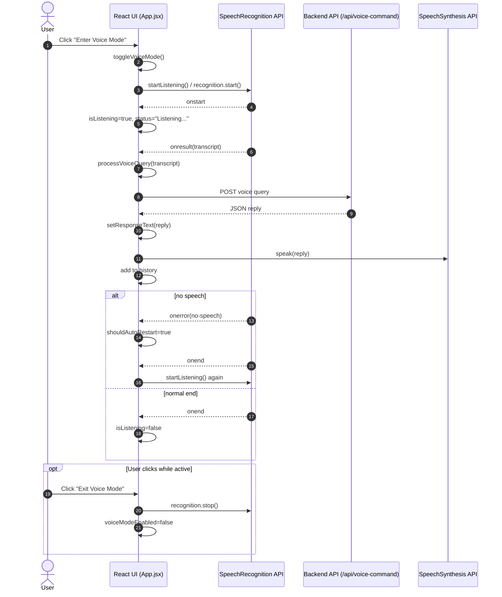

# Voice Mode Sequence Diagram

This diagram shows the end-to-end runtime flow when the user clicks **Enter Voice Mode**.

```mermaid
sequenceDiagram
    autonumber
    actor U as User
    participant UI as React UI (App.jsx)
    participant SR as SpeechRecognition API
    participant BE as Backend API (/api/voice-command)
    participant SS as SpeechSynthesis API

    U->>UI: Click "Enter Voice Mode"
    UI->>UI: toggleVoiceMode()
    UI->>SR: startListening() / recognition.start()
    SR-->>UI: onstart
    UI->>UI: isListening=true, status="Listening..."

    SR-->>UI: onresult(transcript)
    UI->>UI: processVoiceQuery(transcript)
    UI->>BE: POST voice query
    BE-->>UI: JSON reply

    UI->>UI: setResponseText(reply)
    UI->>SS: speak(reply)
    UI->>UI: add to history

    alt no speech
        SR-->>UI: onerror(no-speech)
        UI->>UI: shouldAutoRestart=true
        SR-->>UI: onend
        UI->>SR: startListening() again
    else normal end
        SR-->>UI: onend
        UI->>UI: isListening=false
    end

    opt User clicks while active
        U->>UI: Click "Exit Voice Mode"
        UI->>SR: recognition.stop()
        UI->>UI: voiceModeEnabled=false
    end
```
